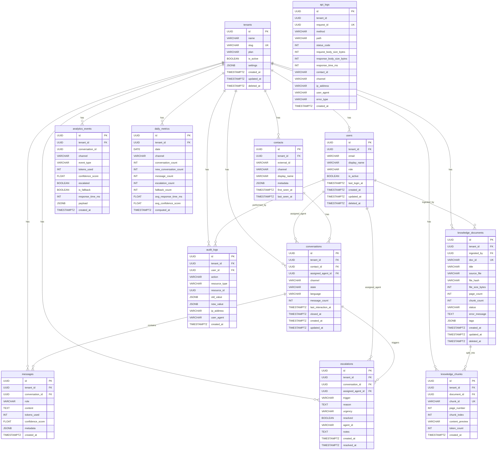

# Database Schema

Kinderuniversiteit AI Support Backend — PostgreSQL schema reference.

## ER Diagram



---

## Tables

### `tenants`
Top-level namespace for multi-tenant deployments. All other tables reference `tenant_id` (nullable — NULL means single-tenant mode). The `slug` is a URL-safe identifier used in API routing and admin UIs.

**Soft delete**: rows are never deleted; `deleted_at` is set instead. Active-tenant queries always add `WHERE deleted_at IS NULL`.

### `users`
Staff accounts (admins, agents, viewers). Not to be confused with `contacts`, which are end-users (students' parents) who message through ManyChat. The `UNIQUE(tenant_id, email)` constraint allows the same email to exist in different tenants.

### `contacts`
Represents a messaging identity — a Facebook page user, Instagram account, or WhatsApp number. Identified by `(external_id, channel)` which maps directly to ManyChat's subscriber ID. One contact may have multiple conversations over time.

### `conversations`
A continuous exchange with a contact on one channel. The `state` column tracks lifecycle: `open → escalated → resolved`. `assigned_agent_id` is set when a human agent takes over from the AI. `closed_at` records when the conversation ended.

### `messages`
Individual turns in a conversation. `role` is `user` or `assistant`. `confidence_score` (0.0–1.0) comes from the RAG pipeline's similarity search. High-volume table — compound index `(conversation_id, created_at)` covers the primary query pattern (load history in order).

### `escalations`
Created when `EscalationRuleEngine` decides human review is needed. `trigger` records the cause (payment_status, financial_request, ai_signal, low_confidence). `urgency` drives queue priority on the agent dashboard. `agent_id` (VARCHAR) is kept for backward compatibility with the old string-based system; `assigned_agent_id` (FK → users) is the future path.

### `knowledge_documents`
Tracks ingested source files (PDFs, Word docs, web pages). `file_hash` enables deduplication — re-uploading an identical file is detected before processing begins. `status` drives the processing pipeline state machine. Soft-deleted so the audit trail is preserved.

### `knowledge_chunks`
Stores the ChromaDB chunk registry. The actual vector data lives in ChromaDB; this table holds metadata and position information. The `UNIQUE(document_id, page_number, chunk_index)` constraint prevents duplicate chunks from re-ingestion.

### `analytics_events`
Append-only event log — one row per AI response or fallback. `is_fallback=true` rows have `conversation_id=NULL` because some errors occur before a conversation is created. `payload` (JSONB) stores `question_text` for FAQ aggregation, source documents, error types, etc. High-write table — consider range partitioning by `created_at` once volume exceeds 10M rows/month.

### `daily_metrics`
Pre-aggregated rollup table computed nightly (or on demand). Eliminates expensive GROUP BY queries on `analytics_events` for dashboard loads. The functional unique index on `COALESCE(tenant_id::text, ''), date, COALESCE(channel, '')` handles the `channel=NULL` row (cross-channel total) correctly, since standard UNIQUE constraints treat every NULL as a distinct value.

### `audit_logs`
Append-only. Records every create/update/delete on sensitive resources. `old_value` and `new_value` (JSONB) capture before/after state for compliance. Never updated or deleted — implement a retention policy via archival rather than DELETE.

### `api_logs`
One row per HTTP request to the FastAPI app. `tenant_id` has **no FK constraint** so unauthenticated requests (which arrive before authentication runs) can still be logged. `request_id` (UUID, unique) ties API logs to structlog's request-scoped context. Highest-volume table — strongly recommended to partition by `created_at` (monthly ranges) when traffic exceeds 1M requests/day.

---

## Enum Types

| PostgreSQL type | Values |
|-----------------|--------|
| `conversation_state` | `open`, `escalated`, `closed`, `resolved` |
| `message_role` | `user`, `assistant` |
| `escalation_trigger_type` | `payment_status`, `financial_request`, `ai_signal`, `low_confidence` |
| `escalation_urgency` | `high`, `normal`, `low` |
| `user_role` | `admin`, `agent`, `viewer` |
| `tenant_plan` | `free`, `starter`, `professional`, `enterprise` |
| `knowledge_document_status` | `pending`, `processing`, `ready`, `failed` |

All enums are defined as PostgreSQL `ENUM` types (not just VARCHAR constraints) for storage efficiency and constraint enforcement at the DB level. Python domain enums in `app/domain/enums/` use `StrEnum` and match the PostgreSQL values exactly.

---

## Design Decisions

### Multi-tenancy approach
All tables have a nullable `tenant_id UUID FK → tenants(id)`. `NULL` means single-tenant mode — existing production data continues to work with no migration-time backfill required. When multi-tenancy is activated: backfill `tenant_id` for all rows, then add `NOT NULL` constraints in a subsequent migration.

All tenant-scoped indexes include `tenant_id` as the leading column so PostgreSQL can use them for both single-tenant and cross-tenant admin queries without a full scan.

### Soft deletes
Applied to `tenants`, `users`, and `knowledge_documents`. Not applied to `messages`, `escalations`, `analytics_events`, or `audit_logs` because those are append-only records. The `contacts` and `conversations` tables omit soft delete for simplicity and can be revisited when a data-retention workflow is built.

### JSONB over JSON
All JSON columns use `JSONB` (binary JSON) for indexed lookups via GIN indexes, `->` and `->>` operators in queries, and better storage efficiency. The analytics FAQ query (`payload->>'question_text'`) relies on this.

### UUID primary keys
All PKs are `UUID v4` generated in Python (`default=uuid.uuid4`). Benefits: no auto-increment coordination across shards, PKs can be generated client-side before the INSERT, no information leakage via sequential IDs. Tradeoff: slightly larger index size than BIGINT.

### Partitioning recommendations
Two tables will grow fastest:
- `analytics_events`: partition by `created_at` (monthly ranges) once >10M rows/month.
- `api_logs`: partition by `created_at` (monthly ranges) once >1M requests/day.

Use `PARTITION BY RANGE (created_at)` with a partition-management job (pg_partman) to create future partitions and archive old ones automatically.

---

## Index Strategy

| Query pattern | Index |
|---------------|-------|
| Conversation history (ordered) | `(conversation_id, created_at)` on messages |
| Agent dashboard — open escalations | `(tenant_id, resolved, urgency)` on escalations |
| Report generation by event type | `(created_at, event_type)` on analytics_events |
| Per-channel analytics | `(created_at, channel)` on analytics_events |
| Tenant-scoped time range scans | `(tenant_id, created_at)` on analytics_events, messages, api_logs |
| Document deduplication | `(file_hash)` on knowledge_documents |
| Active documents only | Partial index `WHERE deleted_at IS NULL` on knowledge_documents |
| daily_metrics uniqueness with NULL channel | Functional index using `COALESCE` |
| Assigned-agent workload | `(assigned_agent_id, resolved)` on escalations; `(assigned_agent_id, state)` on conversations |

---

## Migration Chain

```
0001_initial_schema.py       contacts, conversations, messages
0002_analytics_columns.py    analytics_events: is_fallback, response_time_ms, compound indexes
0003_full_schema.py          tenants, users, knowledge_documents, knowledge_chunks,
                             daily_metrics, audit_logs, api_logs
                             + tenant_id and new columns on existing tables
```

### Run migrations

```bash
# Apply all pending migrations
alembic -c alembic/alembic.ini upgrade head

# Check current revision
alembic -c alembic/alembic.ini current

# Rollback one revision
alembic -c alembic/alembic.ini downgrade -1
```

### Generate a new migration

```bash
alembic -c alembic/alembic.ini revision \
  --autogenerate \
  --message "describe_your_change" \
  --rev-id 0004
```

> **Note**: autogenerate does not detect functional indexes, custom enum types, or `ALTER TYPE … ADD VALUE`. Always review the generated file before running it.
